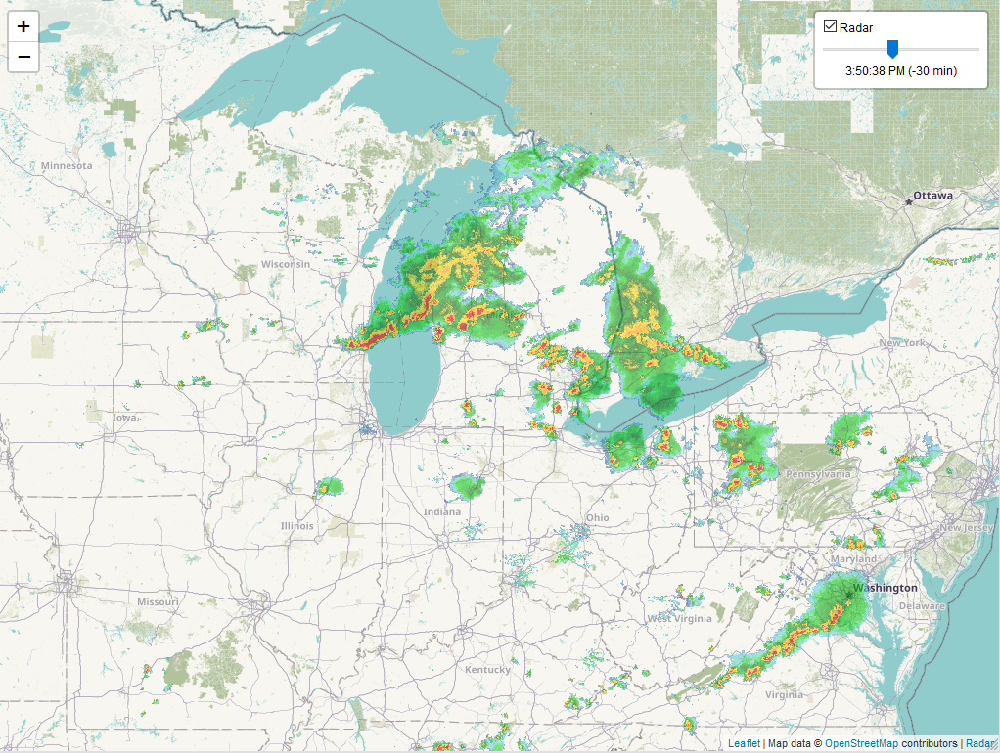

# leaflet-radar [demo](https://rwev.github.io/leaflet-radar)
Animated satellite radar overlays for Leaflet, using free and public Web Map Services (WMS). 

## features
Toggle the radar on and off. Play the radar animation in a loop, or control transition between radar with slider. 

## integration
See [index.html](https://www.github.com/rwev/leaflet-radar/blob/master/index.html).

## dependencies
Just [leaflet](https://www.github.com/leaflet/leaflet). 
